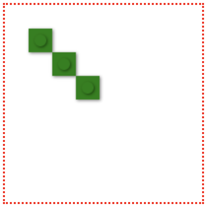
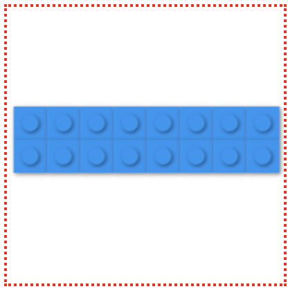
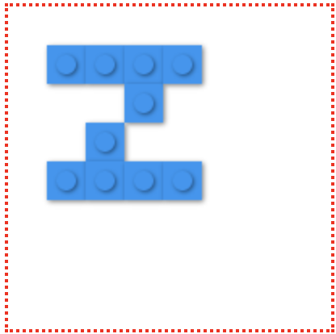
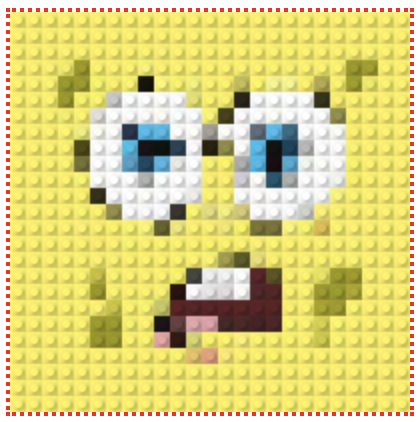
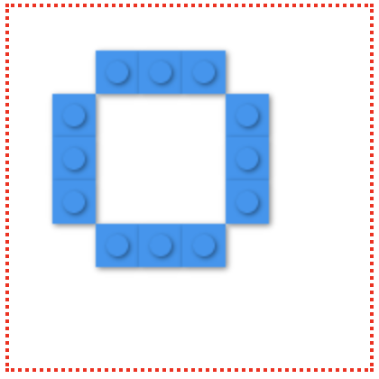
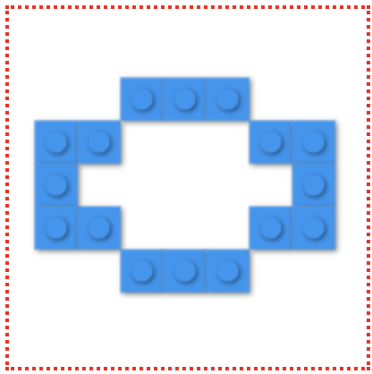
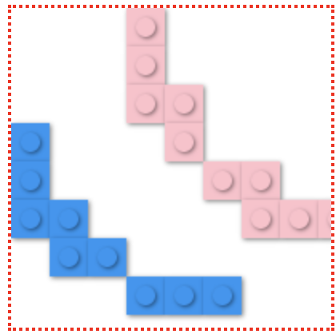
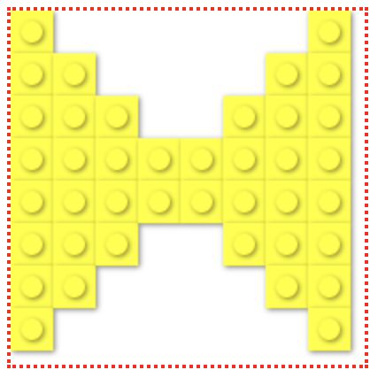

# react-legra

<div align="center">

</div>

> Draw LEGO like brik shapes using [legraJS](https://github.com/pshihn/legra) and Reactjs

[](https://www.npmjs.com/package/react-legra) [](https://standardjs.com)

**react-legra** provides a wrap around the common components of legraJS

## Install

```bash
npm install --save react-legra

// or

yarn add react-legra
```

## Usage

All components but `<Board />`, recieve an optional `options` prop as a configuration object:

```js
{
  color?: string;
  filled?: boolean;
}
```

##### Draw in a **`<Board />`:**

First, you'll need a **board** where you can draw. The `<Board />` component can help you with this.
Additionaly this component recieve a `canvas` prop to use an external canvas

|         prop        |  type   | default |
|:-------------------:|:-------:|:-------:|
| canvas | object |    -    |

```js
import React from 'react'
import Board, { Line } from 'react-legra'

function MyComponent() {

  return (
    <Board>
      <Line from={[3, 3]} to={[10, 10]} />
      // or
      // <Board.Line from={[5, 0]} to={[10, 10]} />
    </Board>
  )
}
```

### Components
----------------

#### `<Line />`

Draw a line from `(x1, y1)` to `(x2, y2)`

|         prop        |  type   | default |
|:-------------------:|:-------:|:-------:|
| from (**required**) | Array[x1, y1] |    -    |
| to (**required**)   | Array[x2, y2] |    -    |



```js
import Board, { Line } from 'react-legra'

function MyComponent() {

  return (
    <Board>
      <Line from={[1, 1]} to={[3, 3]} options={{ color: 'green' }} />
    </Board>
  )
}
```

-----------------------------------------------------------

#### `<Rectangle />`

Draw a rectangle given the top-left coordenates [x, y] (`start`) as the center point and with the specified `width` and `height`

|         prop        |      type     | default |
|:-------------------:|:-------------:|:-------:|
| start (**required**)  | Array[x, y] |    -    |
| width (**required**)  | Integer     |    -    |
| height (**required**) | Integer     |    -    |



```js
import Board, { Rectangle } from 'react-legra'

function MyComponent() {

  return (
    <Board>
      <Rectangle start={[.2, 3]} width={8} height={2}/>
    </Board>
  )
}
```
-----------------------------------------------------------

#### `<LinearPath />`

Draw a set of lines connecting the specified points. `points` is an array of arrays of points `(x, y)`.

|         prop        |                type               | default
|:-------------------:|:---------------------------------:|:-------:|
| points (**required**) | Array[[x1, y1], [x2, y2]...] |    -    |



```js
import Board, { LinearPath } from 'react-legra'

function MyComponent() {

  const points = [[1, 1], [4, 1], [1, 4], [4, 4]]

  return (
    <Board>
      <LinearPath points={points} />
    </Board>
  )
}
```

-----------------------------------------------------------

#### `<Image />`

Draw an image with Legos!!!

|         prop        |  type   | default |
|:-------------------:|:-------:|:-------:|
| src (**required**) | String |    -    |



```js
import Board, { Image } from 'react-legra'

function MyComponent() {

  return (
    <Board>
      <Image src="/spong.jpg" bs={8} />
    </Board>
}
```
-----------------------------------------------------------

#### `<Circle />`

Draw a circle from the `center` point and with the given `radius`

|         prop        |        type     | default |
|:-------------------:|:---------------:|:-------:|
| center (**required**) | Array[xc, yc] |    -    |
| radius | Integer |    10    |



```js
import Board, { Circle } from 'react-legra'

function MyComponent() {

  return (
    <Board>
      <Circle center={[3, 3]} radius={2} />
    </Board>
  )
}
```
-----------------------------------------------------------

#### `<Ellipse />`


Draw an ellipse from the `center` point and the horizontal and vertical axis lenght controlled by `hAxis` and `vAxis` props

|         prop        |        type     | default |
|:-------------------:|:---------------:|:-------:|
| center (**required**) | Array[xc, yc] |    -    |
| hAxis | Integer |    null    |
| vAxis | Integer |    null    |



```js
import Board, { Ellipse } from 'react-legra'

function MyComponent() {

  return (
    <Board>
      <Ellipse center={[3, 3]} vAxis={2} hAxis={3} />
    </Board>
}
```
----------------------------------------------------------

#### `<Arc />`



An arc is just a **section** of an ellipse controlled by the additional `start` and `stop` props which represent the angle of the arc, also you can _"close"_ the arc form by these 2 points with the `filled` prop set to true

|         prop        |        type     | default |
|:-------------------:|:---------------:|:-------:|
| center (**required**) | Array[xc, yc] |    -    |
| hAxis | Integer |    null    |
| vAxis | Integer |    null    |
| start | Integer |    null    |
| stop | Integer |    null    |
| filled | Boolean |    false    |

```js
import Board, { Ellipse } from 'react-legra'

function MyComponent() {

  return (
    <Board>
      <Board.Arc center={[5, 3]} vAxis={4} hAxis={5} start={Math.PI} stop={Math.PI * .5} />
      <Board.Arc
        center={[8, 0]}
        options={{ color: 'pink'}}
        vAxis={5}
        hAxis={5}
        start={Math.PI}
        stop={-Math.PI * .5} />
    </Board>
}
```
---------------------------------------------------------

#### `<Polygon />`

Draw a polygon with the given `vertices`

|         prop        |  type   | default |
|:-------------------:|:-------:|:-------:|
| vertices (**required**) | Array[[]] |    -    |



```js
import Board, { Polygon } from 'react-legra'

function MyComponent() {

  const vertices = [
    [0, 0],
    [0, 7],
    [7, 0],
    [7, 7]
 ]

  return (
    <Board>
      <Polygon vertices={vertices} options={{ color: 'yellow' }} />
    </Board>
}
```
-----------------------------------------------------------

## Development

You'll need run two process (2 tabs) for development:

1.- Watch files and compile them to `dist/`, run on root directory

```js
npm start // Watch and Compile files changes
```

2.- Run the example

```js
cd example
npm start // Run the demo app
```

After that each change you do will be reflected on the demo app

## License

MIT © [christo-pr](https://github.com/christo-pr)
